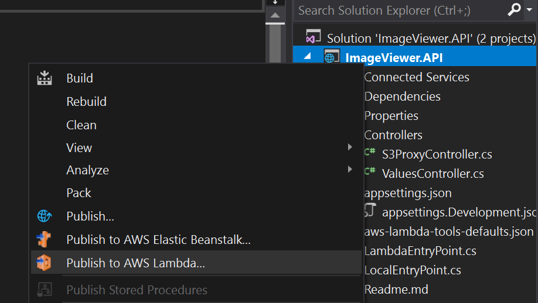
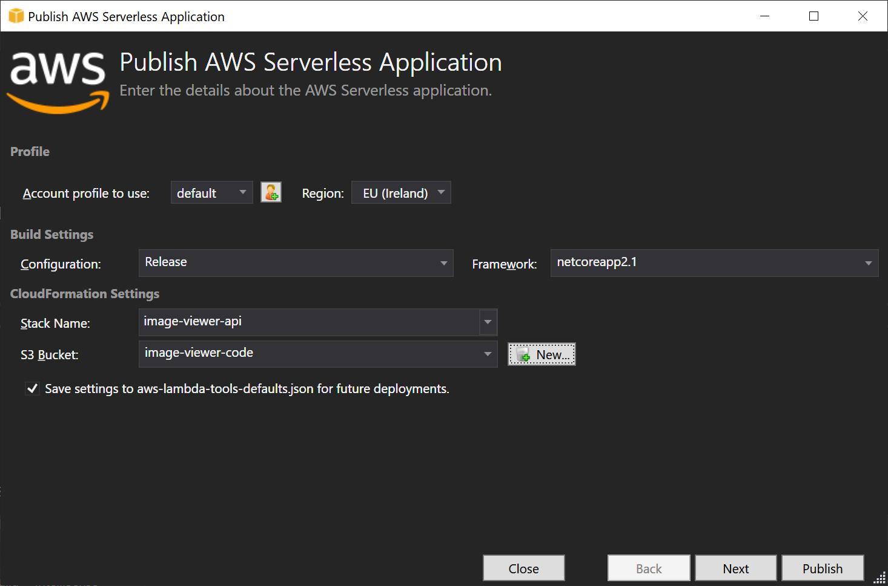
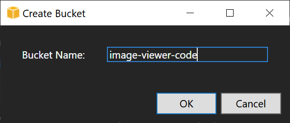
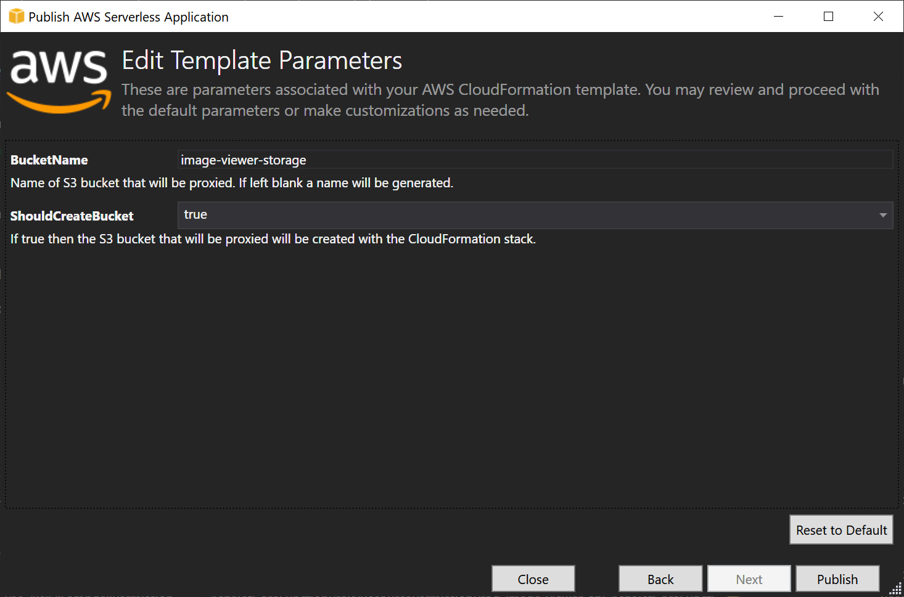
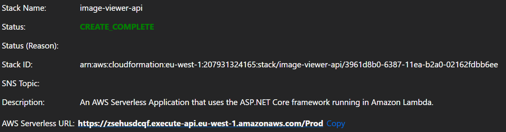

# Part 1 – Create Image Viewer API

## Deploy API Project to AWS

1. Open an **ImageViewer.API.sln** solution from the **samples/ImageViewer.API** folder

2. Enter the S3 Bucket name **image-viewer-images** or similar unique name into **appsettings.json** file as **AppS3Bucket** value. This bucket will store images.

3. Build the project. Check that it compiled without errors.

4. Select **Publish to AWS Lambda...** option in the project menu

    

5. In the opened dialog enter **Stack Name** for example **image-viewer-api**

    

6. Create a new S3 Bucket. Press the **New** button and come up with a unique bucket name, e.g. **image-viewer-code**. This bucket will be used for deployments. It will store archive with compiled binaries and CloudFormation template.

    

7. Press the **Next** button. In the new dialog enter the **BucketName** (from the **appsettings.json** file) where images will be stored.

    

8. Double check the used profile, region and other settings and press **Publish**.
9. Check publish status. Wait for the **CREATE_COMPLETE** state.

    

## Configure CORS for S3

1. Open **AWS Console** and go to the **S3** service
2. Open bucket with images
3. Navigate to **Permissions -> CORS section**
4. Enter the next configuration script and press **Save**

    ```json
    [{
        "AllowedHeaders": [
            "*"
        ],
        "AllowedMethods": [
            "PUT",
            "POST"
        ],
        "AllowedOrigins": [
            "*"
        ],
        "ExposeHeaders": []
    }]
    ```

5. Test that APIs are working.

    - Upload test image to S3. Open **AWS Management Console** and go to the **S3** service.
    - Select the created bucket for images. Press **Upload** and choose any image on your computer.
    - Look at the stack outputs in the Visual Studio and grab the created API’s url. Copy **AWS Serverless URL** value, add **/api/s3proxy/** suffix to it and call. For example, <https://x8tvwsuzlj.execute-api.eu-west-1.amazonaws.com/Prod/api/s3proxy/>
    - The request should return the list of uploaded S3 images.

Great, we have working APIs, then we need to secure them [Part 2 – Secure your application](../part2/part.md)
