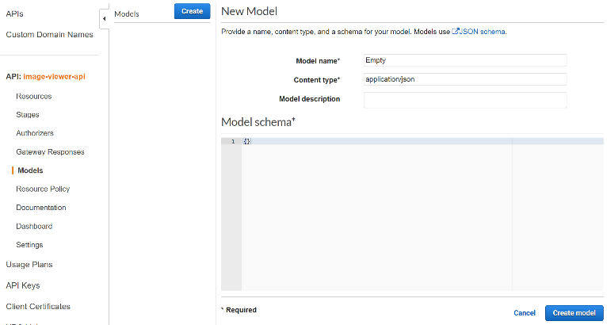
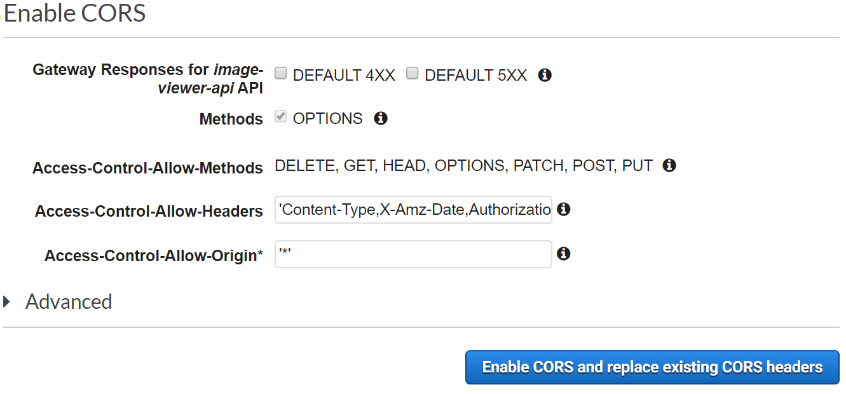

# Part 3 – Deploy Image Viewer Web application

## Create required infrastructure

1. Open **webapp\deploy.yml** file and examine it. Change Default value for **BucketName** parameter to some unique name.
2. Open command line in the **webapp** folder.
3. Prepare infrastructure for the **Image Viewer** web application using the next command. It will create **S3 Bucket** where web site files will be stored and a **CloudFront** distribution to open web site to the world.

    ~~~bash
    aws cloudformation deploy --force-upload --no-fail-on-empty-changeset --stack-name "image-viewer-web-app" --template-file deploy.yml
    ~~~

4. Open the **AWS Console**, go to the **CloudFormation** service. Wait until **image-viewer-web-app** stack will be in the completed state. **Note** It can take up to 20 minutes to create a new CloudFront distribution.
5. Examine outputs tab. Check the created **CloudFront domain**.

## Configure Web application

1. Open **webapp\build\assets\env\environment.values.js** file
2. Enter the next settings
    - **serverUrl** - the newly created **Image Viewer API**, for example, <https://x8tvwsuzlj.execute-api.eu-west-1.amazonaws.com/Prod/api/>
    - **authUrl** –  go to the **Cognito User Pool** and get **Domain URL** plus add **oauth2/** suffix. For example <https://test-image.auth.eu-west-1.amazoncognito.com/oauth2/>
    - **clientId** – go to the **Cognito User Pool -> General settings -> App clients** and get **App client id**
    - **clientSecret** - go to **Cognito User Pool -> General settings -> App clients** and get **App client secret**
    - **redirectUrl** – put URL to the CloudFront with **/auth/callback/** suffix, for ex. <https://d11slzr9srg2n2.cloudfront.net/auth/callback/>
3. Deploy files to **S3** using the next command. Just replace the bucket name

    ~~~bash
    aws s3 sync --cache-control 'no-cache' build/ s3://image-viewer-web-app/Deploy/build
    ~~~

4. Go to the **Cognito User Pool** and configure **App client settings**. Add an additional **Callback URL(s)** after comma (,) wich will point to the CloudFront distribution, for ex. <https://d11slzr9srg2n2.cloudfront.net/auth/callback/>

## Configure CORS for Image Viewer API

1. Open **ImageViewer.Api** project in the VisualStudio

2. Change **WebappRedirectUrl** value to the created **CloudFront URL**, for ex. <https://d11slzr9srg2n2.cloudfront.net>

3. **Publish** the new version of the API.

## Configure CORS for API Gateway

1. Open **AWS Console** and go to the **API Gateway**, select **Models** and create an **Empty** model.

     

2. Go to the **Resources** tab. Select **{proxy+}** method, then expand **Actions** dropdown and press **Enable CORS**.

     

3. Leave everything by default and press **Enable CORS**

     

4. Confirm new settings

     

5. Open **Actions** dropdown and press **Deploy API**.

## Access Image Viewer web application

There are two options how to get access to the **Image Viewer** application

- Use real email and  **Sign-up** into the application. You need real email in order to enter verification code during the sign-up process.
- Or create a test user in the Cognito user pool

1. **Sign-up** with real email

     

2. Create a **test user**

    - Open **image-viewer-pool** Cognito User Pool
    - Select **Users and groups** tab
    - Press **Create user** button
    - Fill the form and press **Create** user

     

3. Sign in with a new user

     

4. Change password if needed.

## Open Image Viewer application

1. Open **CloudFront URL** in the browser. Enter any email\password combination and press **Login**, then you will be redirected to the **Cognito login page**.

2. Use created user to **Sign in**

3. Check that **Image Viewer** application works. Try to upload new images and see them on S3 bucket.

The **Image Viewer** web site is ready now. Then we need to store information about uploaded images in the database. After this the images will be displayed on a web site. Follow the instructions from the next part [Part 4 – Store images in Amazon Aurora Serverless](../part4/part.md).
