# Part 4 – Store images in Amazon Aurora Serverless

## Create Amazon Aurora database

1. Go to the **RDS** service in the **AWS Console**. Select **Databases** tab and press **Create Database** button.

2. Then choose **Standard create** and select **Amazon Aurora** database.

3. Select **MySQL** edition and make it **Serverless**

 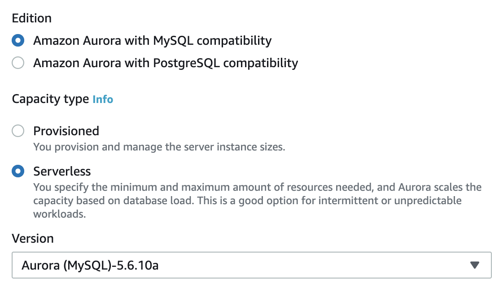

4. In the Settings section enter **image-viewer** cluster name and check **Auto generate a password** option

 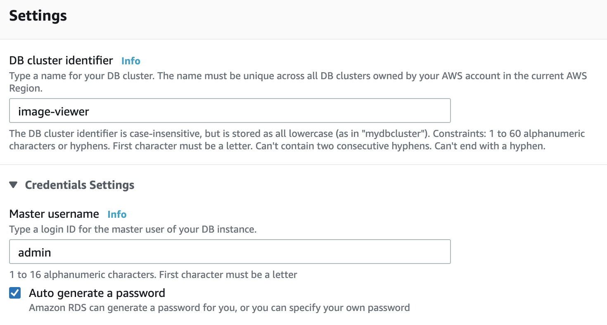

5. Expand small **Additional configuration** section within Connectivity section and enable **Data API**

 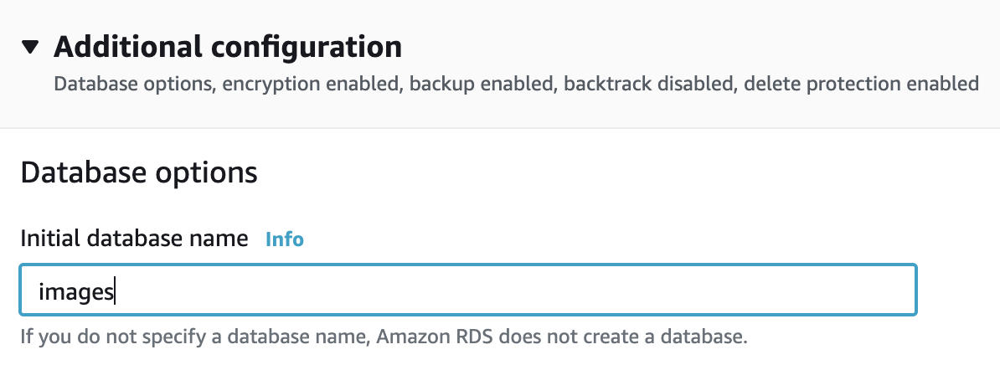

6. Expand new **Additional configuration** section and enter **images** for the initial database name

 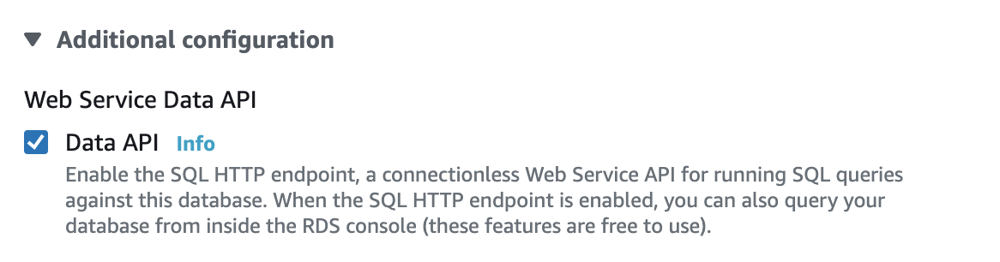

7. Leave everything else by default and press **Create database**

8. It takes a few minutes to create new database. After its creation a green notification will appear, click there on **View connection details** and copy **Master user** and **Master password** somewhere.

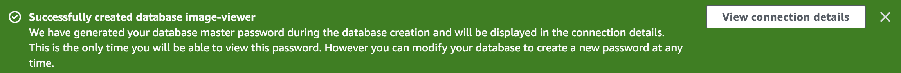

##  Add tables

1. Open **Query editor** tab in the RDS service on AWS Console.

2. In the **Connect to database** window enter the next parameters and press **Connect**
- **image-viewer** - database cluster
- Select **Add new database credentials** and enter
- **admin** - database username
- **Master password** - database password
- **images** - database name

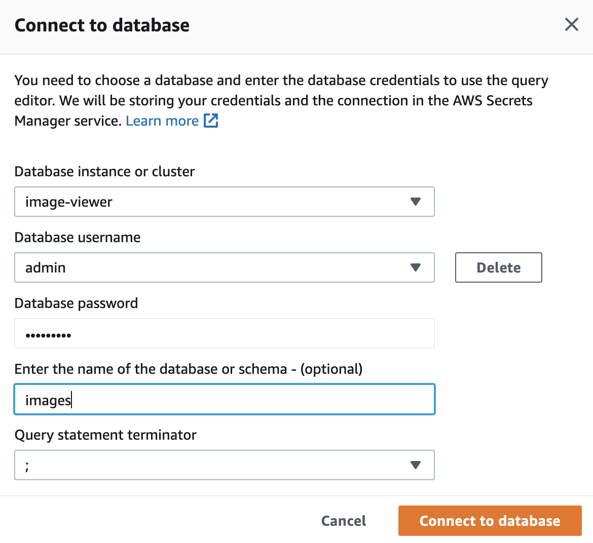

3. Paste the next SQL script in the query editor and create **images** table. 

~~~sql
CREATE TABLE images 
(id INT NOT NULL AUTO_INCREMENT,
s3key VARCHAR(2000), 
etag VARCHAR(500),
lastModified DATE, 
Size BIGINT,
PRIMARY KEY (id));
~~~

4. Paste the next SQL script in the query editor and create **imageTags** table.

~~~sql
CREATE TABLE imageTags
(id INT NOT NULL AUTO_INCREMENT,
imageId INT,
tag VARCHAR(500), 
value VARCHAR(500),
PRIMARY KEY (id),
FOREIGN KEY (imageId) REFERENCES images(id));
~~~

## Deploy Image Viewer labeling function

1. Open an **ImageViewer.Labeling.sln** solution from the **samples/ImageViewer.Labeling** folder

2. Open the **aws-lambda-tools-defaults.json** file and put there Aurora settings to the **environment-variables**. They should be separated with semicolon **;** for example **AuroraSecretArn=arn:aws:secretsmanager..;AuroraArn=arn:aws:rds:...;DatabaseName=images;**.

3. Launch **Publish to AWS Lambda...** dialog

     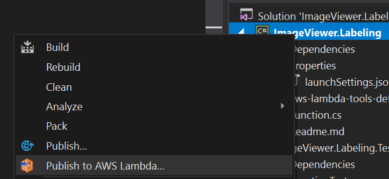

4. Enter or adjust **Function Name** **image-viewer-labeling** and press **Next**

     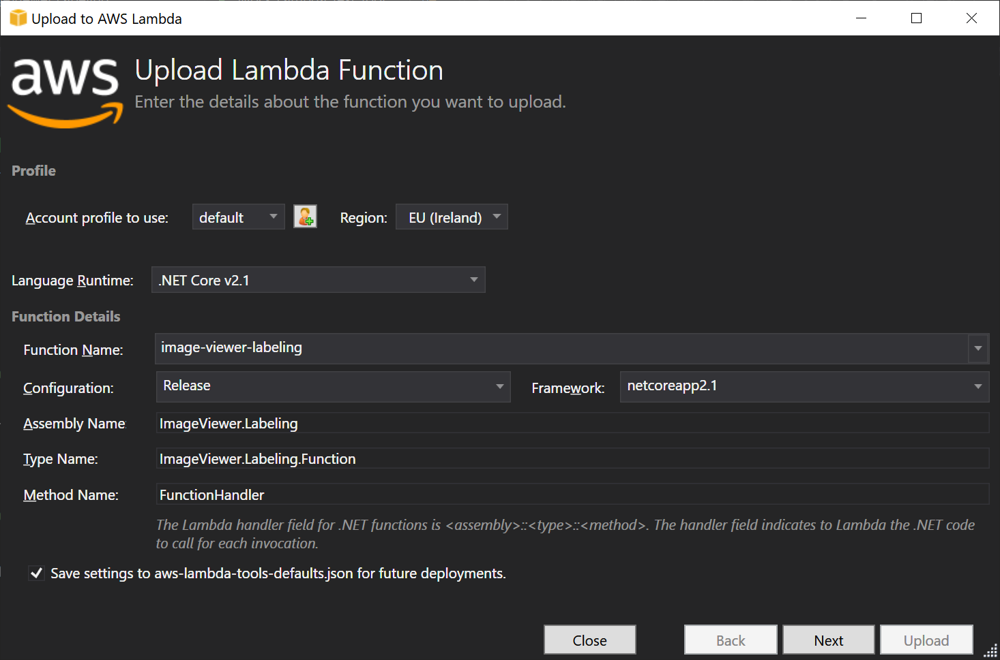

5. Choose a new role base on **AWSLambdaFullAccess** policy and press **Upload**

## Configure S3 Trigger

1. Open **AWS Console** and go to the **Lambda** service.
2. Select **image-viewer-labeling** lambda function.
3. Press **Add Trigger** button.
4. Select **S3** and fill required parameters, then press **Add**
    - **Bucket** – select bucket with images
    - **Event type** – All object create events

     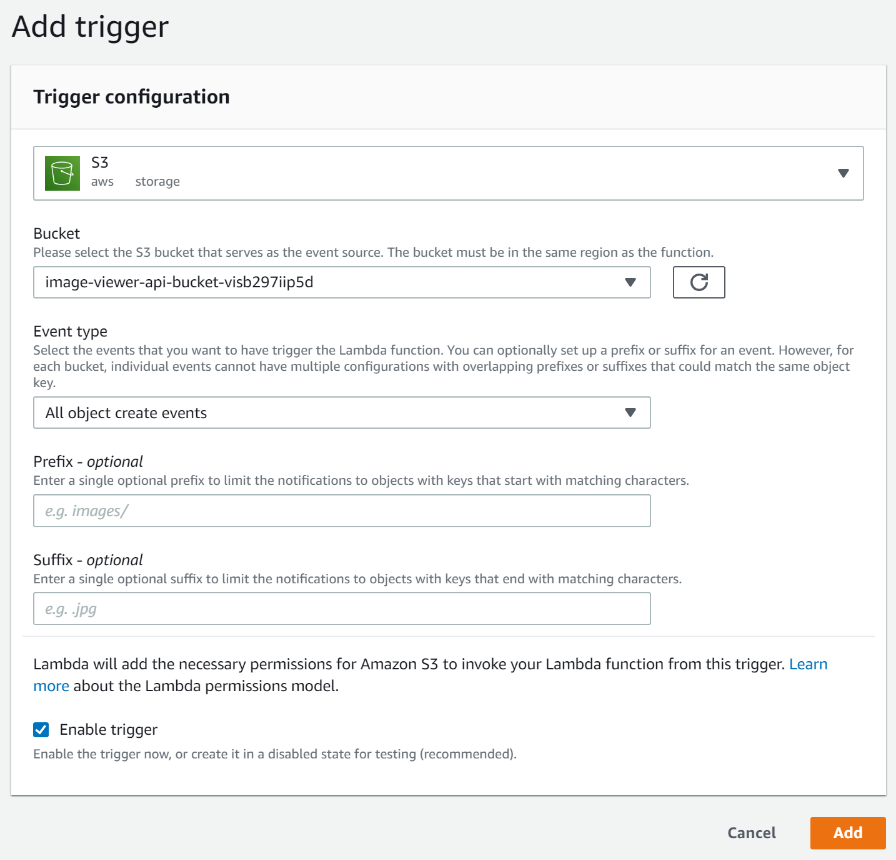

## Add permissions to call AWS Rekognition and other services

1. Select **Configuration** part and then **Permissions** tab. In the **Execution Role** section press on role name and go to the IAM console.

     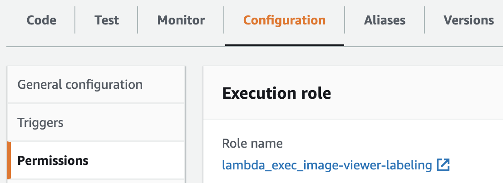

2. Add a new policy to it, press **Attach policies**

     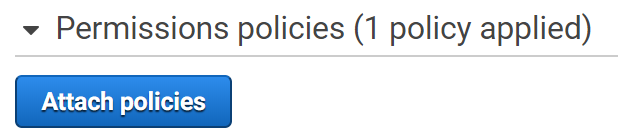

3. Select **AmazonRekognitionFullAccess**

     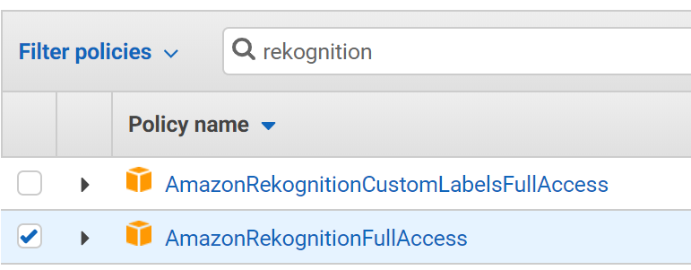

4. Press **Attach** policy

5. In the same manner add **AmazonRDSDataFullAccess** and **AWSLambdaExecute** policies.

## Redeploy Image Viewer API

1. Open **appsettings.json** file and set Aurora Database parameters:
- **DatabaseName** - set **images**
- **AuroraArn** - the ARN of Aurora cluster, you can get it in the **Configuration** section in your cluster
- **AuroraSecretArn** - go to the **Secrets Manager** in the AWS Console and select secret with DB credentials, something starts with **rds-db-credentials...**, and grab **Secret ARN**.

2. Examine the **Services/ImagesAuroraRepository.cs** file where the main work with Amazon Aurora is placed. For our purposes we need only two requests to get all images and delete image. We use Auroras **Data API** to work with database.

3. Publish a new version to the AWS.
4. Add **AmazonRDSDataFullAccess** policy to the role of Lambda API function.

5. The application is ready now! Try to label new images.
    - Open the **Image Viewer** web site and upload new image.
    - Find new image in the table and examine created tags for it. It may take some time so use a **Refresh** button to update table

You have completed the Amazon Aurora Serverless part of the workshop! Now let's create the same functionality using Amazon DynamoDB. So go to the [Part 5 – Work with Amazon DynamoDB](../part5/part.md) section. 
