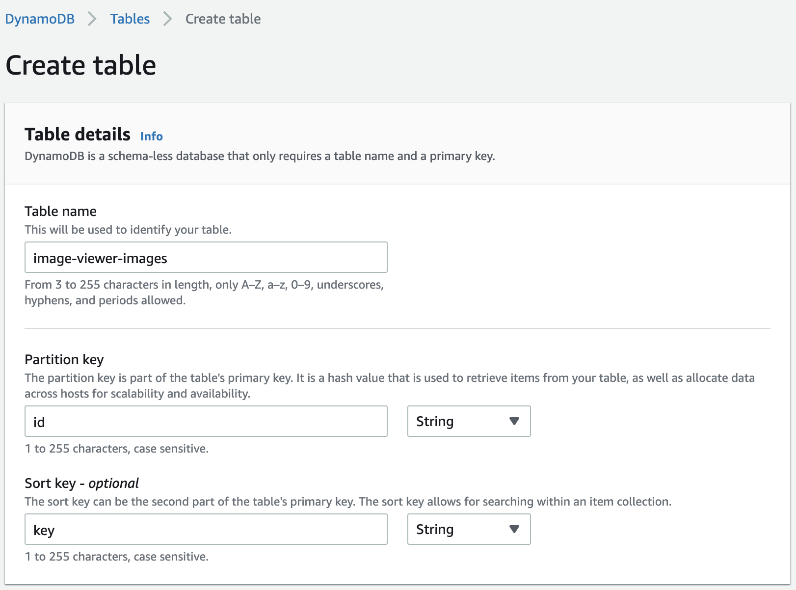

# Part 5 – Work with DynamoDB

## Create DynamoDB table for images

1. Go to the **DynamoDB** service in the  **AWS Console**. Select **Tables** tab and press **Create Table** button. Enter the next info in the form:
   - **Table name** - **image-viewer-images** or similar value.
   - **Partition key** - **id** attribute
   - **Sort key** - **key** attribute

     

2. Then choose **Customize settings** and select **On-demand** capacity mode.

     

3. Leave everything else by default and create table

## Redeploy Image Viewer API

1. Open **appsettings.json** file and set **DynamoDbImagesTable** parameter with the name of newly created DynamoDB table.

2. Examine the **Services/ImagesDynamoDbRepository.cs** file where the main work with DynamoDB is placed. For our purposes we need only two requests to get all images and delete image.

3. In the **Startup.cs** file uncomment the registration of **ImagesDynamoDbRepository** and comment the previous **ImagesAuroraRepository** line.
~~~c#
services.AddTransient<IImagesRepository>(c => new ImagesDynamoDbRepository(Configuration["DynamoDbImagesTable"]));

//services.AddTransient<IImagesRepository>(c => new ImagesAuroraRepository(Configuration["AuroraSecretArn"], Configuration["AuroraArn"], Configuration["DatabaseName"]));
~~~

4. Publish a new version to the AWS.
5. Add **AmazonDynamoDBFullAccess** policy to the function's role.

## Redeploy Image Viewer labeling function

1. Open an **ImageViewer.Labeling.sln** solution from the **samples/ImageViewer.Labeling** folder

2. Open the **aws-lambda-tools-defaults.json** file and put the name of the images DynamoDB table to the **environment-variables**, for example **DynamoDbImagesTableName=image-viewer-images;**.

3. In the **Function.cs** file uncomment the **SaveToDynamoDbAsync** method call anf comment the old **SaveToAuroraAsync** call.
~~~C#
await SaveToDynamoDbAsync(record.S3.Object.Key, record.S3.Object.ETag, record.S3.Object.Size, tags);
//await SaveToAuroraAsync(record.S3.Object.Key, record.S3.Object.ETag, record.S3.Object.Size, tags);
~~~

4. Publish a new version of the Image Viewer Labeling function.
5. Add **AmazonDynamoDBFullAccess** policy to the function's role.

6. The application works with DynamoDB now! Try to label new images.
    - Open the **Image Viewer** web site and upload new image.
    - Find new image in the table and examine created tags for it. It may take some time so use a **Refresh** button to update table

The next step is to add a little bit of analytics and calculate the top used image tags. Follow the instructions from the [Part 6 – Top tags analytics](../part6/part.md) section.
