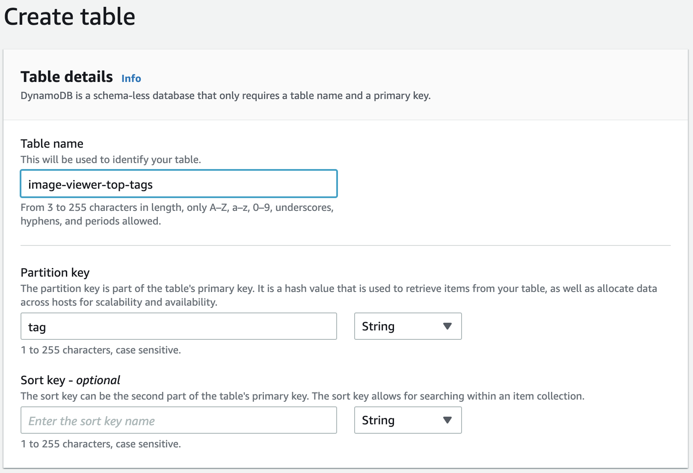
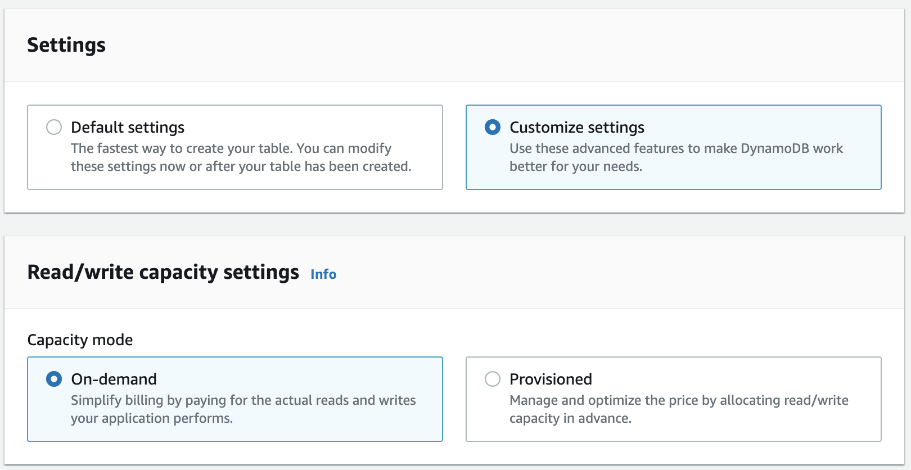
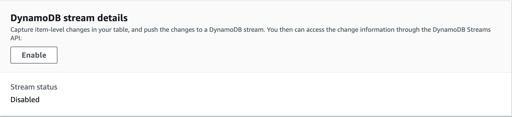
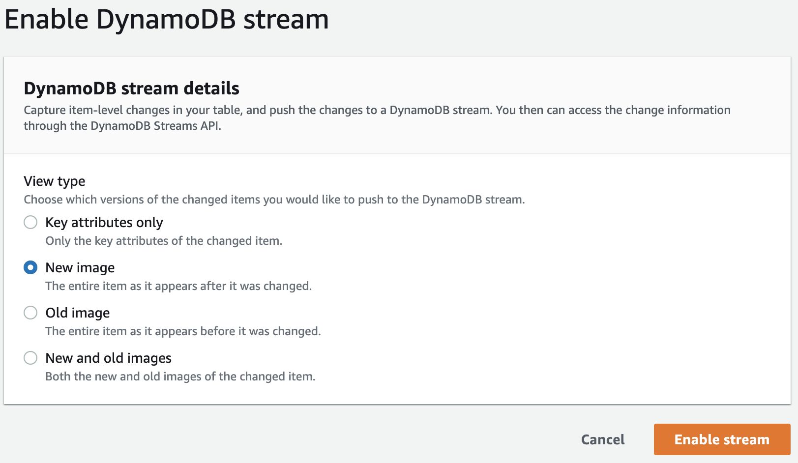
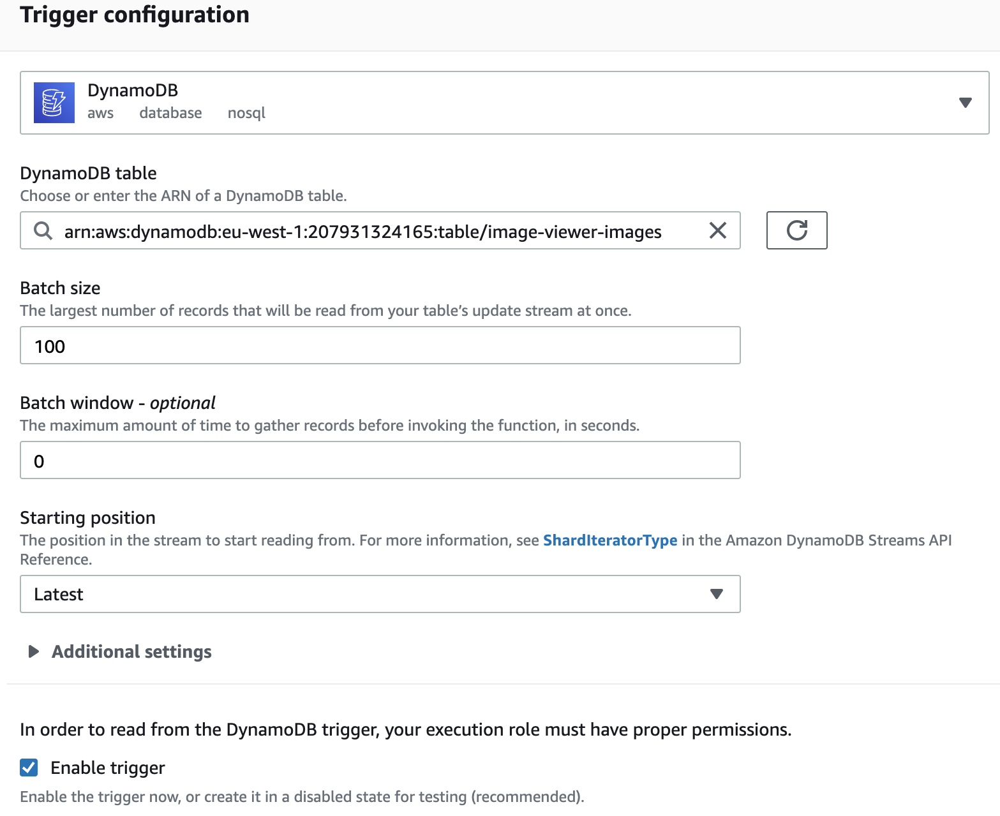

# Part 6 – Top tags analytics

## Create DynamoDB table for image tags

1. Go to the **DynamoDB** service in the  **AWS Console**. Select **Tables** tab and press **Create Table** button. Enter the next info in the form:
   - **Table name** - **image-viewer-top-tags** or similar value.
   - **Partition key** - **tag** attribute
   - **Sort key** - leave it empty

     

2. Then choose **Customize settings** and select **On-demand** capacity mode.

     

3. Leave everything else by default and create table

## Enable DynamoDB streams for the images table

1. Open **image-viewer-images** table in the DynamoDB service on AWS Console.

2. Select **Exports and streams** tab and scroll to the bottom to the **DynamoDB stream details** section and press **Enable** button.



3. Choose **New Image** option and enable stream.



## Deploy Image Viewer Top Tags function

1. Open an **ImageViewer.TopTags.sln** solution from the **samples/ImageViewer.TopTags** folder.

2. Open the **aws-lambda-tools-defaults.json** file and put the name of the top tags DynamoDB table to the **environment-variables**, for example **TopTagsTable=image-viewer-top-tags**.

3. Build project and check that build has no errors

4. Open command line in the **samples/ImageViewer.TopTags** folder and execute the next command. Note: the same deployment steps can be performed via **Publish to AWS Lambda...** dialog.

```
dotnet lambda deploy-function
```

5. Choose **Create a new IAM role** and enter **lambda_exec_image_viewer_top_tags** or similar role name.

6. Choose a new role base on **AWSLambda_FullAccess** policy and deploy function.

7. After deploy add **AmazonDynamoDBFullAccess**  and **AWSLambdaExecute** policies to the function's role.

## Configure DynamoDB Trigger

1. Open **AWS Console** and go to the **Lambda** service.
2. Select **image-viewer-top-tags** lambda function.
3. Press **Add Trigger** button.
4. Select **DynamoDB** and fill required parameters, then press **Add**
    - **DynamoDB table** – select DynamoDB table with images
    - Leave everything else by default

     

5. Upload and label new images.
6. Go to the **DynamoDB** service in the AWS Console and explore items of the **image-viewer-top-tags** table. The table should contain the statistics for all new image tags.

You have completed the DynamoDB part of the workshop! Congrats, now you are able to work with both serverless Amazon databases! So its time to remove everything and go to the [Part 7 – Clean-up resources](../part7/part.md) section. 
